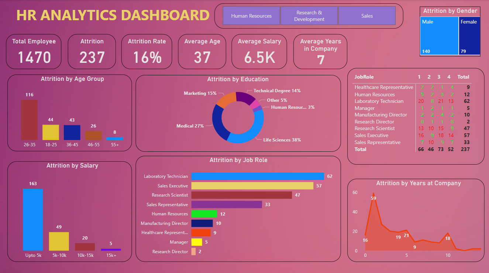

# HR_Analytics_Dashboard

## Overview
The HR Analytics Dashboard is an advanced analytical tool created using Power BI to help visualize and analyze employee attrition data. It provides insights into employee demographics, job roles, and attrition trends, aiding HR departments in making data-driven decisions.

## HR Analytics Dashboard

This image showcases the main dashboard of the HR Analytics Dashboard, highlighting several key metrics and visualizations:

**Total Employees** : Displays the total number of employees in the company (1470).  
**Attrition** : Shows the number of employees who left the company (237).  
**Attrition Rate** : Indicates the percentage of employees who left the company (16%).  
**Average Age** : Provides the average age of employees (37 years).  
**Average Salary** : Shows the average salary of employees (6.5K).  
**Average Years in Company** : Indicates the average tenure of employees (7 years). 

## Visualizations:
**Attrition by Age Group** : Bar chart showing the distribution of attrition across different age groups.  
**Attrition by Education** : Pie chart displaying the attrition rate based on educational background.  
**Attrition by Job Role** : Bar chart highlighting the attrition rate among different job roles.  
**Attrition by Salary** : Bar chart showing the attrition rate based on salary ranges.  
**Attrition by Gender** : Stacked bar chart depicting the attrition distribution by gender.  
**Attrition by Years at Company** : Line chart showing the attrition rate based on the number of years employees have spent at the company.  
**Job Role Breakdown** : Table showing the number of employees in each job role and their attrition details.  

